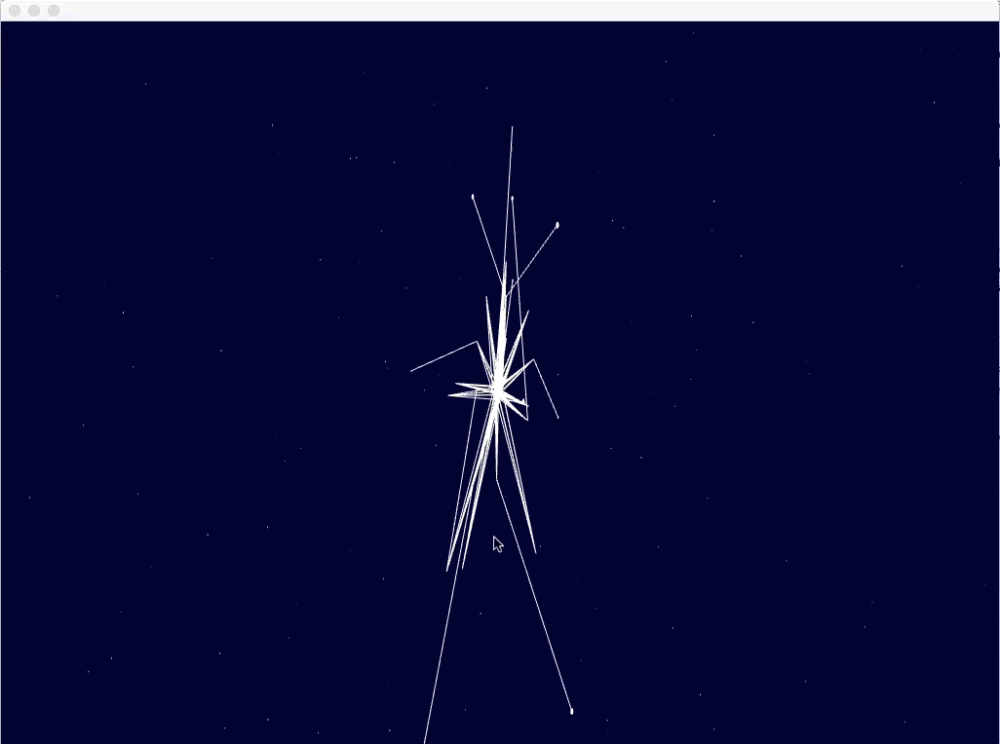

# OpenFrameworks Experiments

This is a collection of stuff I made using [OpenFrameworks](http://openframeworks.cc/). A lot were made during my time at the [School for Poetic Computation](http://sfpc.io/) in the Code class taught by [Zach Lieberman](http://thesystemis.com/).  Zach was inspired by the [Recode project](http://recodeproject.com/) to center his class around recreating artworks from the past using modern tools. The recreation could either be a direct translation where the recreation is very close to the original or it could be more experimental and a response to the original artwork. My work tends to fall in both buckets. The code for the examples Zach covered in class are [here](https://github.com/ofZach/sfpcRecreatingThePastSpring2018).

## Ken Knowlton

Made a mosaic of my baby picture featuring stills from nollywood (nigerian) movies I watched growing up.

## Walking Data

Zach gave us walking data and told us to do something cool with it. I made a walking constellation.

## Muriel Cooper

## Vera Molnár

  
  

